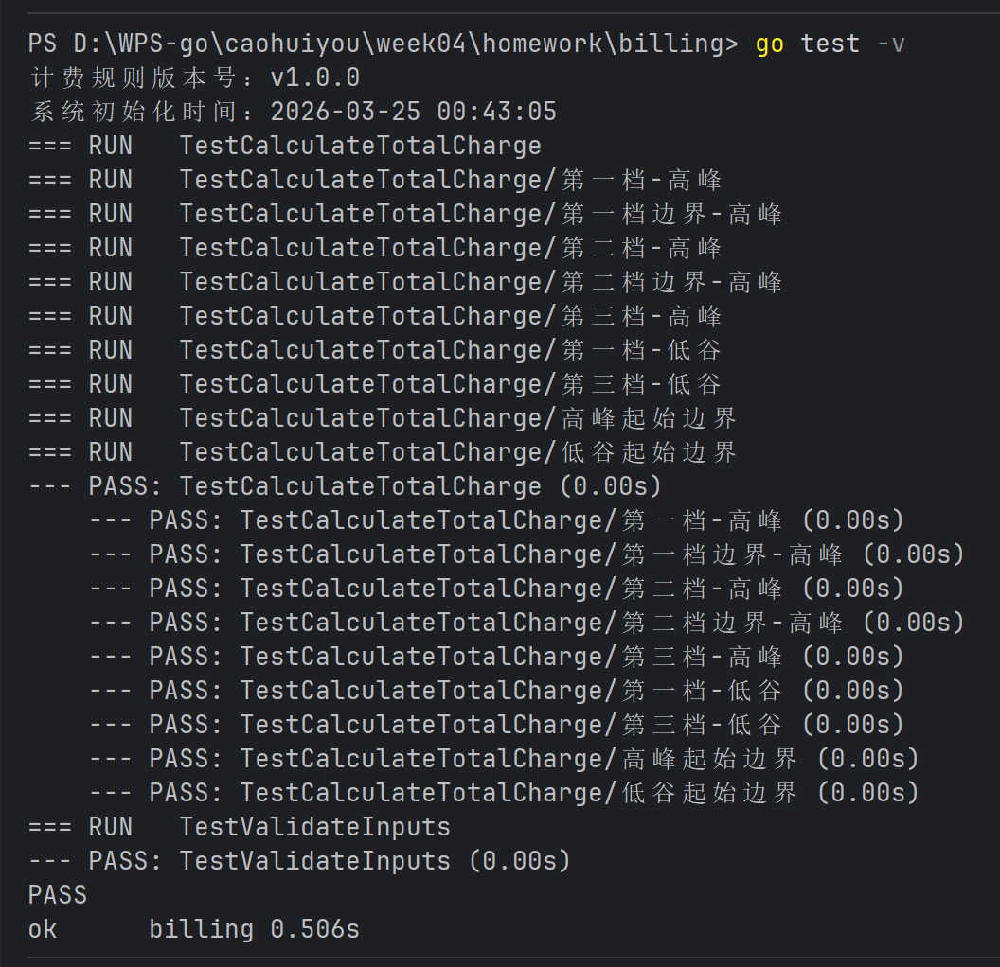

# 智能阶梯计费系统

## 学生信息

- 学校：武汉科技大学
- 姓名：曹会友
- 学号：202313407447

## 已完成功能
核心业务
- 支持根据用电量进行阶梯电价计费（三档阶梯）。
- 支持根据用电时段（高峰/低谷）进行电价调节，精准匹配边界。

系统交互
- 提供交互式命令行界面，用户可输入用电量和时段，实时计算并打印账单。
- 输入合法性校验（用电量非负，时段在 0-23 之间）。
- 支持 `exit` 命令退出程序。

系统输出
- 实现系统初始化自动输出计费规则版本号与当前系统时间。

测试功能
- 编写单元测试全覆盖核心逻辑，包含阶梯边界、峰谷时段、非法输入等场景。

## 关键逻辑说明

先根据使用量计算基础电费，再根据用电时段匹配峰谷调节系数，基础电费 × 调节系数即为最终应付电费。

## 函数列表

| 函数名                    | 功能说明                         |
|------------------------|------------------------------|
| `init`                 | 程序启动时自动调用，打印计费规则版本和当前系统时间。   |
| `validateInputs`       | 校验用电量和时段是否合法。                |
| `calculateTotalCharge` | 根据阶梯规则和时段系数计算最终电费。           |
| `printBill`            | 打印账单明细，包括用电量、时段和最终电费。        |
| `runBilling`           | 主交互循环，接收用户输入，调用其他函数完成计费与输出。  |
| `main`                 | 程序入口，调用 `runBilling()` 启动系统。 |

## 单元测试截图

测试通过截图已放在 [assets/test-pass.png](./assets/test-pass.png)

## 开发难点

**边界值的处理**  
对于恰好等于档位上限的情况（如 200 度、400 度），需要确保计入正确的档位。  
我采用 `<=` 判断第一档，`<=` 判断第二档，否则为第三档的方式，确保边界值被正确归类。

**输入合法性检验**  
既要检验输入类型合法，也需要检验输入值是否在指定范围内。  
输入类型合法由 `runBilling` 判断，输入值合法封装到 `validateInputs()` 函数中，通过抛出异常的方式返回错误信息。