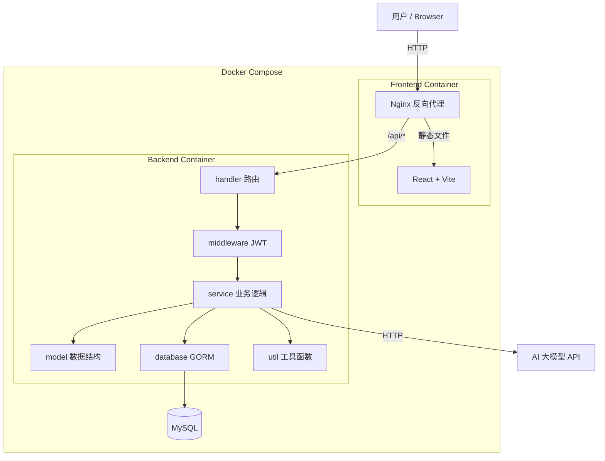

# AI 智能单词本


## 一、学生信息

- 学校：武汉科技大学
- 姓名：曹会友
- 学号：202313407447


## 二、 开发任务索引

本项目完成的核心任务如下：

- 使用 `Go + Gin` 实现后端 API
- 使用 `MySQL 8.0` 存储用户与单词本数据
- 使用 `JWT` 实现登录鉴权
- 使用 `React + Vite` 实现前端页面
- 使用 `Nginx` 作为生产环境统一入口
- 使用 `Docker Compose` 完成 `db`、`backend`、`frontend` 三服务编排
- 使用 `docs/init.sql` 初始化数据库结构，不在代码中使用 `AutoMigrate`
- 编写 [api.md](D:\WPS-go\caohuiyou\week05\homework\docker-gin\docs\api.md) 与 [db.md](D:\WPS-go\caohuiyou\week05\homework\docker-gin\docs\db.md) 文档

## 三、 项目简介

用户在前端输入英文单词并选择 AI 提供方后，后端先查询当前用户自己的单词本：

- 如果数据库中已存在该单词，则直接返回已保存结果
- 如果数据库中不存在，则调用 AI 接口生成中文释义和 3 条英文例句
- 用户确认后，可将查询结果手动保存到自己的单词本

项目采用前后端分离结构：

- 前端：负责登录、查词、保存、分页查看和删除操作
- 后端：负责鉴权、业务处理、数据库访问和 AI 请求转发
- 数据库：保存用户信息和单词本记录
- Nginx：在生产环境中统一暴露前端页面和 `/api` 接口入口

### 3.1 架构说明




### 3.2 项目目录

```text
docker-gin
├── backend/                # Go 后端
│   ├── config/             # 配置加载
│   ├── database/           # 数据库连接初始化
│   ├── handler/            # 接口处理器
│   ├── middleware/         # JWT 鉴权中间件
│   ├── model/              # 数据模型
│   ├── service/            # 业务逻辑与 AI 调用
│   ├── util/               # JWT / 响应封装
│   ├── .env                # 环境变量模板
│   └── Dockerfile
├── frontend/               # React + Vite 前端
│   ├── src/                # 业务组件
│   ├── nginx.conf          # nginx配置(反向代理)
│   ├── vite.config.js
│   └── Dockerfile
├── docs/
│   ├── api.md              # API 接口文档
│   ├── db.md               # 数据库设计文档
│   └── init.sql            # 数据库初始化脚本
├── docker-compose.yml      # Docker Compose 编排文件
└── README.md
```


## 四、 运行指南

本节为项目运行的核心说明，描述从零启动流程。

### 4.1 前置依赖

运行本项目需要提前安装：

- Docker
- Docker Compose

可先使用以下命令确认环境：

```bash
docker --version
docker compose version
```

### 4.2 AI API Key 配置

后端通过 [backend/.env](D:\WPS-go\caohuiyou\week05\homework\docker-gin\backend\.env) 读取配置。当前仓库中的 `.env` 不包含真实密钥，需要自行填写。

当前 `.env` 中与 AI 相关的配置项如下：

```env
DEEPSEEK_API_KEY=
DEEPSEEK_BASE_URL=https://api.deepseek.com/v1/chat/completions
DEEPSEEK_MODEL=deepseek-chat

QWEN_API_KEY=
QWEN_BASE_URL=https://dashscope.aliyuncs.com/compatible-mode/v1/chat/completions
QWEN_MODEL=qwen-plus
```

使用说明：

- 如果要使用 `deepseek` 查询单词，需要填写 `DEEPSEEK_API_KEY`
- 如果要使用 `qwen` 查询单词，需要填写 `QWEN_API_KEY`
- 如果两个密钥都不填，项目仍可启动，但调用 AI 查词接口时会返回对应错误

### 4.3 数据库初始化方式


初始化脚本位于：

- [init.sql](D:\WPS-go\caohuiyou\week05\homework\docker-gin\docs\init.sql)

在 Docker Compose 启动时，`docker-compose.yml` 会将该脚本挂载到 MySQL 容器的 `/docker-entrypoint-initdb.d/` 目录中，首次启动时自动执行。

### 4.4 一键启动命令

在项目根目录执行：

```bash
docker compose up -d --build
```

说明：

- `--build`：重新构建前后端镜像
- `-d`：后台启动容器

该命令会完成以下工作：

- 启动 `db` 服务（MySQL 8.0）
- 启动 `backend` 服务（Gin API）
- 启动 `frontend` 服务（Nginx 托管前端页面）
- 自动执行数据库初始化脚本
- 建立容器内部共享网络

### 4.5 启动后如何访问

启动完成后，浏览器访问：

```text
http://localhost
```

访问说明：

- `frontend` 容器对外暴露 `80` 端口
- 前端页面由 Nginx 提供
- `/api` 请求由 Nginx 反向代理到 `backend:8080`
- `backend` 再通过服务名 `db:3306` 连接 MySQL

### 4.6 停止项目

停止容器：

```bash
docker compose down
```

如果需要连同数据库卷一起删除并重新初始化：

```bash
docker compose down -v
```


## 五、 跨域与代理说明


### 开发环境

- 前端由 Vite 提供开发服务器
- [vite.config.js](D:\WPS-go\caohuiyou\week05\homework\docker-gin\frontend\vite.config.js) 将 `/api` 代理到 `http://localhost:8080`

### 生产环境

- 前端静态资源由 Nginx 提供
- [nginx.conf](D:\WPS-go\caohuiyou\week05\homework\docker-gin\frontend\nginx.conf) 将 `/api/` 反向代理到 `backend:8080`
- 浏览器始终只访问同一个入口 `http://localhost`


